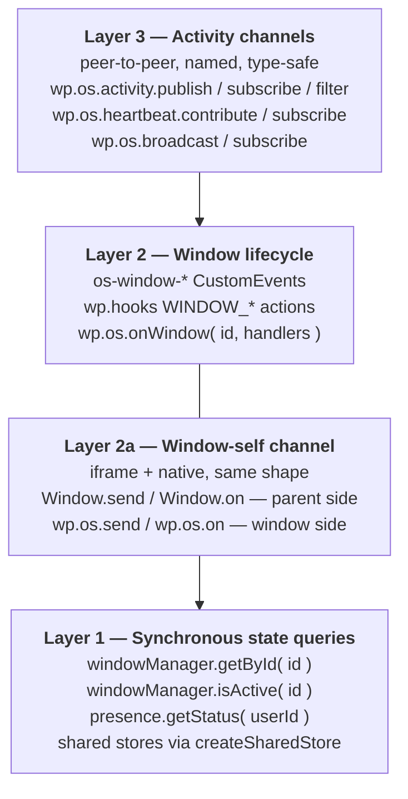
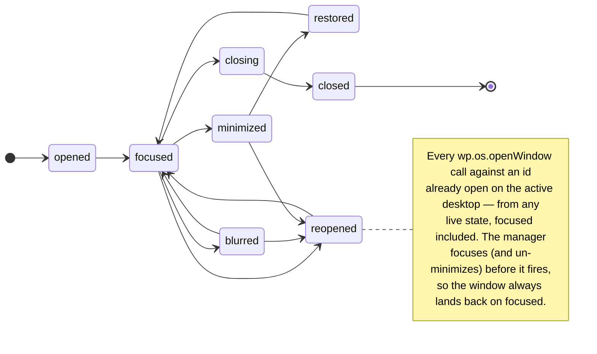

# The event-driven framework

**Stable.**

The OpenStation plugin is structured as a small, opinionated **OS
shell** plus a set of **apps** (the recycle bin, the code editor,
third-party plugins). The shell does NOT make UX decisions for
apps. The shell is a transport — it publishes events apps can
subscribe to, exposes synchronous state queries apps can poll,
and offers a typed channel bus for app-to-app communication.
**Apps own their UX policy.** When the OS notifies an app that
something happened (a window got focused, a peer plugin published
a state change), the app decides what to do based on its own
internal state.

This document is the contract for that pattern. If you're building
an app on top of OpenStation, read it once. If you're reviewing
a PR that touches anything in `src/desktop.ts` /
`src/native-windows.ts` / `src/dock.ts`, this is the design test:
**did we add a UX heuristic to the framework, or did we expose a
hook the app can subscribe to?**

## The three layers



### Layer 1 — synchronous state

The framework keeps live state on `wp.os.*` and apps query
it whenever they need a snapshot. **Reads never throw, never
race, never block.**

```js
const win    = wp.os.windowManager.getById( 'my-plugin/inbox' );
const active = wp.os.windowManager.isActive( 'my-plugin/inbox' );
const dot    = wp.os.presence.getStatus( authorId );
const store  = wp.os.createSharedStore( 'my/state', () => ( { x: 0 } ) );
```

If you're building a "show this thing only when the user can't
already see my window" UI, `windowManager.isActive(id)` is the
canonical query — it collapses four sub-checks (window exists,
not minimized, focused, on the active virtual desktop) into one
boolean. A window that's focused on a Space the user has since
switched away from does NOT count as active.

For a multi-instance window (`multi: true`, ids like
`${baseId}-2`, `${baseId}-3`), `isActive(id)` only ever answers
for one exact id. Use `windowManager.isActiveByBaseId(baseId)`
instead — it returns `true` if *any* instance sharing that
`baseId` is the currently focused window (still scoped to the
active desktop). This is the query `src/recycle-bin/icon-state.ts`
switched to so its badge doesn't stay suppressed while the user
is looking at a *different* recycle-bin instance.

### Layer 2 — window lifecycle

Every native window emits this state machine on the action bus
(`wp.hooks`) AND as document CustomEvents. Apps pick whichever
flavour fits.



**Custom events** (filter by `e.detail.windowId === MY_ID`):

| CustomEvent | Detail |
|---|---|
| `os-window-opened`      | `{ windowId, page, title, url }` |
| `os-window-reopened`    | `{ windowId, baseId, wasMinimized, navigated }` — `navigated`: the request carried a URL the window wasn't showing, so the existing iframe navigated to it in place |
| `os-window-focused`     | `{ windowId }` |
| `os-window-blurred`     | `{ windowId, focusedTo }` |
| `os-window-closing`     | `{ windowId, element }` |
| `os-window-closed`      | `{ windowId }` |
| `os-window-changed`     | `{ windowId?: string, reason: 'moved' \| 'resized' \| 'state' \| 'cascade' \| 'tile', state?: WindowState }` — batch-arrange dispatches (`'cascade'` / `'tile'`) omit `windowId`/`state` |

Same payloads on `wp.hooks` actions:
`HOOKS.WINDOW_OPENED`, `…_FOCUSED`, `…_BLURRED`, `…_CLOSED`,
`…_MINIMIZED`, `…_RESTORED`, `…_MAXIMIZED`, `…_UNMAXIMIZED`,
`…_FULLSCREEN_ENTERED/EXITED`, `…_REOPENED`, plus geometry events
(`…_RESIZED`, `…_BODY_RESIZED`, `…_BOUNDS_CHANGED`,
`…_DRAG_START/END`, `…_RESIZE_START/END`).

**Per-window facade.** `wp.os.onWindow(id, handlers, options?)`
is a typed wrapper that binds handlers and filters by id for you.
Two lifetime modes:

```js
// One-shot per-instance. Auto-unsubscribes on `closed` — the
// next open of the same id needs a fresh subscribe.
const off = wp.os.onWindow( 'my-plugin/inbox', {
    focused: () => clearAttention(),
    closed:  () => recordSession(),
} );

// App-lifetime — keeps firing every time the window reopens.
// Use this for badge policies, DND rules, anything that must
// react to every open + close cycle of the page.
wp.os.onWindow(
    'my-plugin/inbox',
    {
        opened:    () => repaintBadge(),
        focused:   () => repaintBadge(),
        blurred:   () => repaintBadge(),
        minimized: () => repaintBadge(),
        restored:  () => repaintBadge(),
        closed:    () => repaintBadge(),
        reopened:  () => repaintBadge(),
    },
    { persistent: true },
);
```

**The `persistent` footgun.** Without `persistent: true`, your
handler stops firing after the first close. A badge policy that
subscribes once at boot but uses the default mode will look
broken the second time the user opens the window. If the rule
is "react to every state change for the lifetime of the tab,"
you want `persistent: true`.

### Layer 2a — the window-self channel

Lifecycle tells you *that* a window opened, focused, blurred,
closed. **The window-self channel tells you what's happening
INSIDE the window content.** Two methods, deliberately
unifying iframe and native windows:

```js
// Outside the window — anywhere in the shell.
const win = wp.os.windowManager.getById( 'wpdc-editor' );
win.send( 'editor:open-file', { path: 'foo.php', line: 42 } );
const off = win.on( 'editor:saved', ( payload ) => repaint( payload ) );

// Inside an iframe (chromeless wp-admin OR `iframeContent` native body).
wp.os.send( 'editor:saved', { path, size } );
const off = wp.os.on( 'editor:open-file', ( { path, line } ) => {
    openFile( path, line );
} );

// Inside a native render callback — second arg carries the
// window-scoped binding so you don't have to look up your own id.
wp.os.registerWindow( {
    id: 'my-tool',
    render: ( body, { window } ) => {
        body.querySelector( 'button' ).addEventListener( 'click', () => {
            window.send( 'tool:saved', {} );
        } );
        const off = window.on( 'tool:reset', () => { /* … */ } );
        return () => off();
    },
} );
```

**The framework picks the delivery mechanism.** Iframe windows
go via `postMessage` (the bridge translates `Window.send` to
`os-window-send` and `wp.os.send` back up to
`os-window-publish`). Native windows route in-process
through the channel bus. Plugin authors **never** branch on
window type and **never** reach for `postMessage` directly.

**Subscribers auto-clean.** When a window closes, every
`Window.on` and native `windowApi.on` subscriber bound to its id
is dropped. Reopening the same id starts with an empty
subscriber set — no stale callbacks fire against the new
instance.

**`wp.os.connect()` works identically for both.** The
peer-to-peer connection bridge — used when one window wants to
talk to another — routes through the same channel bus when the
target is native. Pre-0.5.5 it silently no-op'd on native
targets; now `conn.send` / `conn.subscribe` reach the render
context's `windowApi` listeners. Same `onOpen` / `isOpen` /
`disconnect` semantics for both kinds.

**What this replaces.** `Window.iframeSend` is gone (0.5.5
removed it — the unified `Window.send` does the same job, with
the same pre-load FIFO buffering, while also working for
pure-native windows). `wp.os.iframe.publish/subscribe`
stays for the multi-listener handshake-aware `wp.os.connect()`
flow, but new code should reach for `wp.os.send/on` first —
same call regardless of whether the window content is an iframe
or a native render.

### Layer 3 — activity channels

For app state changes that PEER apps might want to know about
(unread counts, item counts, mode toggles, …):

```js
// Publish.
wp.os.activity.publish( 'inbox/unread-changed', { total: 5 } );

// Subscribe.
const off = wp.os.activity.subscribe(
    'inbox/unread-changed',
    ( { total } ) => repaintMyWidget( total ),
);

// Filter — let other plugins mutate the value before peers see it.
const safe = wp.os.activity.filter(
    'inbox/outgoing-payload',
    payload,
    { author: 7 },
);
```

Channels follow the convention `<plugin>/<event>`. The runtime
routes them through `os.activity.<channel>` on the hook
bus, so devtools can list activity traffic as a discrete group.
Hook names can't contain a slash (`@wordpress/hooks` rejects the
registration), so the channel separator becomes a period there:
`my-plugin/thing-happened` lands on
`os.activity.my-plugin.thing-happened`. Only relevant if
you register through raw `wp.hooks` instead of the API below.
Type the payload by augmenting `ActivityChannelMap` in your own
`.d.ts`:

```ts
import type {} from 'openstation/activity';

declare module 'openstation/activity' {
    interface ActivityChannelMap {
        'my-plugin/something-happened': { id: number; reason: string };
    }
}
```

**Built-in channels.** Every framework primitive that publishes
mirrors here so plugins can subscribe through one unified API. The
`os/` namespace is the shell's own — subscribe and filter freely,
but publish your events under your plugin's slug:

| Channel | Filterable? | When it fires |
|---|---|---|
| `os/toast-requested` | Yes — `cancel: true` to drop, mutate to rewrite | Pre-show on every `showToast()`. |
| `os/toast-shown` | No (post-render) | After the toast lands in the DOM. |
| `os/notification-requested` | Yes — `cancel: true` to drop, mutate to rewrite | Pre-render on every `wp.os.notify()`. |
| `os/notification-shown` | No (post-render) | After the notification (or its toast fallback) renders — payload carries `fallback: 'toast' \| null`. |
| `os/window-attention-requested` | Yes — `cancel: true` for DND, mutate `mode`/`durationMs` to scale | Pre-attention on every `Window.requestAttention()` (which then routes the filtered result to the rails' `setAttention()`). Direct `dock.setAttention()` calls bypass the filter. |
| `os/badge-changed` | No | Every `setBadge()` on dock / taskbar / icons. Payload carries `rail: 'dock' \| 'taskbar' \| 'icon'` so a single subscriber can compose across surfaces. |
| `os/open-requested` | No | Every `wp.os.openWindow()`, BEFORE deciding `opened` vs `reopened`. Carries `source`. |
| `os/presence-changed` | No | Every presence transition (mirror of the `os-presence-changed` CustomEvent). |
| `os/presence-snapshot-applied` | No | After every presence batch — `{ applied, transitions }`. |
| `os/game-score-recorded` | No | After a game's `submitScore()` write resolves (free play and challenge completion both). Games play in their own window, so this is how a leaderboard in another window learns it went stale. Payload carries `challengeId` on the completion path. |
| `os/upload-hud-complete` | No | After a file dropped on the shell finishes uploading — `{ filename, attachmentId }`. Published by the progress HUD, not the uploader: the upload runs on XHR (the only transport that reports determinate progress) and so never routes through `wp.os.fetch`, which makes this the bus's only view of a completed drop. |

**Activity ↔ broadcast mirror.** `wp.os.broadcast(topic, payload)`
publishes both onto the broadcast bus (cross-iframe, cross-tab)
AND onto the activity bus (in-tab) under the same topic name.
Use `broadcast` when peers might be in another iframe / tab
(the recycle bin's `os.data-changed` topic is the
canonical example); use `activity.publish` when you only need
in-tab fan-out.

Because the mirror is verbatim and `hookName()` collapses `/` to
`.`, a channel and a topic that differ only in that separator
land on the same hook: `os/badge-changed` and a topic
`os.badge-changed` both resolve to
`os.activity.os.badge-changed`. The two namespaces have always
shared one hook space — pre-rebrand it was `desktop-mode` on both
sides — and nothing in-tree collides. Just don't name a broadcast
topic after a built-in channel.

### Layer 3+ — the heartbeat bus

A specialised pub/sub for things that ride the WordPress
Heartbeat (`heartbeat-send` / `heartbeat-tick`). Pre-0.5.5 every
feature that wanted a per-tick payload bound the jQuery events
itself; with the bus, multiple plugins compose without any
boilerplate.

```js
// Outgoing — add a field to the next heartbeat-send.
const off = wp.os.heartbeat.contribute(
    'my-plugin/active',
    () => isActive() ? true : undefined,   // undefined = skip this tick
);

// Incoming — read a field on the heartbeat-tick response.
const offIn = wp.os.heartbeat.subscribe(
    'my-plugin/payload',
    ( v ) => applyServerSnapshot( v ),
);
```

**Last-writer-wins for `contribute`.** Re-contributing the same
field replaces the previous supplier, so a plugin can swap
policies cleanly. **Many subscribers compose for `subscribe`** —
the bus dispatches each registered subscriber for an incoming
field. Errors in any one supplier or subscriber are logged and
isolated; one bad handler can't strand peers.

The framework's own features are built on top: `presence`
contributes `openstation_presence_active` + `openstation_user_active`
and subscribes to `openstation_presence`. Plugins that need a
per-tick delivery story (live counts, server-driven badges,
session keep-alives) plug into the same bus.

## The principle, restated

The framework's job is to **publish events**, **expose state**,
and **route data** between plugins. The framework's job is NOT
to make UX decisions on the plugin's behalf.

An earlier version of the framework had the *Dock* auto-suppress
badges while a window was active. We reverted that — the
reasons:

- The Dock can't know what every app's badge means. A "5 unread
  notifications" badge SHOULD suppress when the inbox is open. A
  "5 failed deploys" badge probably SHOULDN'T even when the
  deploy console is open — the user wants to see the count
  regardless.
- Apps that disagree with the framework heuristic can't override
  it without forking. The framework can change the heuristic and
  break apps silently.
- Two writers (the Dock's auto-paint + the app's setBadge) end up
  fighting over the same DOM. Race conditions, flicker.

The new pattern: **the app subscribes to its own window's
lifecycle and calls `dock.setBadge(id, count)` with whatever count
makes sense for its current state**. The Dock paints whatever
the app asked for — period.

## Worked example — a unread-counter badge policy

```js
// A canonical "show 0 while my window is active, otherwise the
// real count" badge owned by the plugin (NOT the framework).
const WINDOW_ID = 'my-plugin/inbox';

function repaintBadge() {
    const total   = myPlugin.getUnreadCount();
    const active  = wp.os.windowManager.isActive( WINDOW_ID );
    const visible = active ? 0 : total;
    // Plugin's policy. The rails just render whatever we pass.
    // The rail that owns the id paints, the others silently
    // no-op. One activity event fires.
    wp.os.dock?.setBadge?.(     WINDOW_ID, visible );
    wp.os.sideDock?.setBadge?.( WINDOW_ID, visible );
    wp.os.icons?.setBadge?.(    WINDOW_ID, visible );
}

// React to either axis changing.
wp.os.activity.subscribe( 'inbox/unread-changed', repaintBadge );
[ HOOKS.WINDOW_OPENED, HOOKS.WINDOW_FOCUSED, HOOKS.WINDOW_BLURRED,
  HOOKS.WINDOW_MINIMIZED, HOOKS.WINDOW_RESTORED, HOOKS.WINDOW_CLOSED,
  HOOKS.WINDOW_REOPENED ].forEach( ( h ) =>
    wp.os.hooks.addAction( h, 'my-ns', ( p ) => {
        if ( p.windowId === WINDOW_ID ) {
            repaintBadge();
        }
    } )
);
repaintBadge(); // initial paint
```

**Multi-instance windows** (`multi: true`) need
`windowManager.isActiveByBaseId( baseId )` instead of `isActive(
id )` in `repaintBadge()` above — otherwise the badge only
suppresses for the exact instance id first opened, and stays
visible while the user is looking at instance `-2` or `-3`. See
[`src/recycle-bin/icon-state.ts`](../src/recycle-bin/icon-state.ts) for the
full pattern, including matching lifecycle events across every
instance id sharing the base.

**There is no `wp.os.taskbar` accessor.** The three badge
rails are `wp.os.dock` (the primary bottom rail),
`wp.os.sideDock` (the Classic-layout left rail — `null` in
Unified), and `wp.os.icons` (wallpaper shortcuts).
The `rail` discriminator on emitted events is a separate axis:
the bottom-anchored primary dock stamps `rail: 'taskbar'` onto
the events it emits (e.g. `os/badge-changed`), while
`sideDock` stamps `rail: 'dock'` and the icon rail `rail: 'icon'`.

## What NOT to do (anti-patterns)

**Don't** read window state from a state mirror you populate via
CustomEvents. The mirror drifts when events drop or fire out of
order. Use `windowManager.getById/isActive` for synchronous reads.

**Don't** add UX heuristics inside framework primitives. If the
behaviour you want is "show 0 in the badge when the window is
active", own it in your app. The framework should keep the door
open for apps that want different policies.

**Don't** build a bespoke `window.__myPluginShared` slot when you
need to share state across bundles. Use
`wp.os.createSharedStore('your-plugin/key', …)` — same
shape, dedupes for free, namespaced.

**Don't** wire a `document.addEventListener('os-window-*', …)`
when `wp.os.onWindow(id, handlers)` already does the
windowId filter for you. Faster to write, easier to type.

## OS-level events beyond windows

Not every transition is a window transition. The framework announces
OS-level state changes on the same dual surface (document
CustomEvent + hook action) so apps decide their own policy:

| CustomEvent | Hook | Meaning |
|---|---|---|
| `os-auth-lost` | `os.auth.lost` | The login session expired (Heartbeat `wp-auth-check` verdict). Pause pollers; requests will 401. |
| `os-auth-restored` | `os.auth.restored` | The session is back and cached nonces are fresh again — resume + re-sync. |

Consistent with the framework's transport-not-policy rule, the shell
doesn't pause anyone's poller itself — it tells you, you decide. See
[Session expiry & recovery](./javascript-reference.md#session-expiry--recovery-stable)
for the full contract.

## Reference

- [JS reference](./javascript-reference.md) — full per-API docs.
- [Hooks reference](./hooks-reference.md) — full PHP filter / action signatures.
- [`docs/examples/`](./examples/) — copy-paste recipes.
- In-tree consumer worth reading:
  - [`src/recycle-bin/icon-state.ts`](../src/recycle-bin/icon-state.ts)
