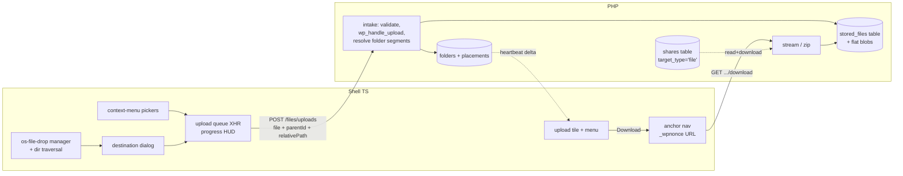

# feat: Real file/folder storage on the desktop (DESKMOD-45)

## Summary

Add real per-user file storage to OpenStation as a new `upload` file type layered on the existing desktop-files system: bytes live flat on disk under a protected uploads subdirectory with server-generated names, hierarchy/sharing/sync stay in the existing folders + placements + shares tables, downloads are PHP-streamed (file as-is, folder as an on-demand ZipArchive .zip), and sharing reuses the shares table's `target_type` seam with recipients hard-limited to read + download.

---

## Problem Frame

Desktop tiles today are references to WordPress entities (posts, media, users, folders as groupings). There is no way to upload an arbitrary file, or a whole folder tree, and have real bytes land on the server, tied to the uploading user, downloadable later, shareable with other users. Linear DESKMOD-45 closes that gap. The issue already settles transport: browser multipart/POST (drag-and-drop or picker), explicitly not FTP.

Four scoping decisions were confirmed interactively during planning: flat disk layout, the owner-locked sharing model, a drop-dialog destination choice, and the `upload_files` capability gate.

---

## Requirements

- R1. Upload files by dragging onto the desktop wallpaper or a folder window, or via a picker; real bytes stored server-side, associated with the uploading user.
- R2. Upload entire folder trees (drag a folder in, or directory picker); hierarchy is preserved as desktop folders.
- R3. Each OpenStation user gets their own per-user storage area on the server.
- R4. Right-click, then Download on an uploaded file streams the file back unmodified.
- R5. Right-click, then Download on a folder streams an on-demand .zip of its stored-file contents.
- R6. The owner can share an uploaded file or folder with specific users via the existing invite/accept flow; recipients get read + download only (no move, no rename, no delete); only the owner can delete or move.
- R7. UI reuses the existing tile / context-menu / drag-manager / progress-HUD patterns; no new UI paradigms.
- R8. Works anywhere Core runs (shared hosting, wp-env/Docker); zero extra services; degrades gracefully (e.g. missing ZipArchive).

---

## Scope Boundaries

- No FTP or any non-HTTP transport (explicitly rejected in the issue).
- No chunked/resumable uploads in v1. The server intake keeps "receive bytes" and "validate + register" internally separate so tus/Content-Range can drop in later without changing the route contract.
- No preview/thumbnail rendering of uploads in v1; the default opener is Download. Preview windows are a follow-up.
- No per-user quota UI; a filterable quota seam ships (default: unlimited), admin UI later.
- No Media Library integration: stored files are not attachments and never appear in the Media Library. The existing drop-to-Media-Library path remains reachable via the destination dialog.
- No public/anonymous share links; sharing is site-user-to-site-user only, like folder sharing today.
- No role-principal shares for single files in v1 (user principals only; folder sharing keeps its existing role support).
- No owner transfer (consistent with folder sharing).
- No X-Sendfile / X-Accel-Redirect default; PHP streaming is the zero-config default, acceleration is a follow-up opt-in.

### Deferred to Follow-Up Work

- Resumable/chunked upload layer (tus or Content-Range) reusing the receive/register seam.
- Signed short-lived download tokens (the download route reserves a `token` param) for PWA/service-worker contexts.
- Preview openers (image/PDF viewer windows) for the `upload` type.
- Quota administration UI on top of the filter seam.

---

## Context & Research

### Relevant Code and Patterns

- `includes/desktop-files/class-openstation-file.php`, `registry.php`, `built-in-types.php`, `types/`: the file-type contract the new `upload` type plugs into.
- `includes/desktop-files/schema.php` (`OPENSTATION_FILES_SCHEMA_VERSION`, ensure-helpers; note the deliberate non-dbDelta comment for the shares tables), `store.php` (placement CRUD, tombstones, write gates), `shares-store.php` (grants, `target_type` column, capability resolver), `sharing.php` (visibility), `heartbeat.php` (delta protocol, priority 5), `rest.php` (routes, `If-Match` 409 pattern, 404-when-disabled share-route pattern).
- `src/os-file-drop/` (manager, dialog, upload via XHR + progress, HUD, `os.drop.*` hooks): the direct precedent for upload UX; today its only sink is `wp/v2/media` and it has no directory-tree handling.
- `src/desktop-files/` (layer, grid, tile-spec, tile-menu, drag-payloads, rest, store, shares-store, share-settings-modal, share-menu-items): tile rendering, context menus, drag, share UI to extend.
- `src/drag/manager.ts` + `drop-target-registry.ts`: in-shell drag; OS-file drops are separate (window-level listeners in os-file-drop).
- Tests: `tests/phpunit/tests/desktopFiles*.php` (store/REST/shares suites, direct-callback invocation pattern, schema install in `set_up()`), `tests/vitest/os-file-drop-*.test.ts` and `desktop-files-*.test.ts`.
- Docs contract: `docs/files-on-desktop.md` ("references, not copies" is the core mental model this feature amends), `docs/folder-sharing.md` (capability matrix, path independence, v1 non-goals include non-folder sharing).

### External References

- OWASP File Upload and Path Traversal cheat sheets; Patchstack/Wordfence upload-bypass catalogs (double extensions, `.phtml`/`.phar`, dotfiles).
- WP REST auth handbook: `_wpnonce` as a query parameter is officially supported for GET; missing nonce downgrades to anonymous rather than erroring.
- `wp_handle_upload()` / `wp_check_filetype_and_ext()` / `upload_dir` filter mechanics (verified against wordpress-develop source).
- WooCommerce download handler + nginx uploads-protection posture; core privacy-export ZipArchive precedent (`privacy-tools.php`).
- MDN Entries API: `webkitGetAsEntry`, `FileSystemDirectoryReader.readEntries` 100-entry batching; `webkitdirectory` picker. File System Access API is Chromium-only and excluded.
- Google Drive folder model (hierarchy as metadata) vs Nextcloud filecache (mirrored tree) as the storage-model comparison.

### Implementation gotchas surfaced by research

- `wp_handle_upload()` outside a form context requires `'test_form' => false` (the REST attachments controller does exactly this). Failure mode otherwise: "Invalid form submission."
- The `mimes` override passed to `wp_handle_upload()` can only narrow policy: `wp_check_filetype_and_ext()` re-checks the resolved type against `get_allowed_mime_types()` regardless. Our policy is WP-allowed minus a denylist, i.e. narrow-only, so this works in our favor; expanding types would additionally need a scoped `upload_mimes` filter.
- If `post_max_size` is exceeded, PHP delivers an empty `$_POST`/`$_FILES`; detect via `CONTENT_LENGTH` and answer a clear 413.
- `dataTransfer.items` is live and cleared once the drop handler yields: call `webkitGetAsEntry()` on every item synchronously before any `await`.
- Drag-dropped `File` objects have an empty `webkitRelativePath`; relative paths come from `entry.fullPath` (strip the root segment). Only `webkitdirectory` picks populate `webkitRelativePath`.
- `readEntries()` returns at most 100 entries per call in Chromium; loop the same reader until it returns an empty array.
- Streaming from a REST route: the server sends the JSON `Content-Type` before dispatch; the sanctioned short-circuit is the `rest_pre_serve_request` filter (return `true` after streaming). Drain all output buffers first so `Content-Length` stays exact; send `Accept-Ranges: none`.
- `ZipArchive::open()` returns `true` or an int error code (strict-compare against `true`); `addFile()` defers reads to `close()`, so source files must survive until then and very large trees can hit fd limits (batch close/reopen if needed). `wp_tempnam()` creates the file and the caller must delete it.
- Media Library flat-date-bucket storage and Google Drive's parents-as-metadata model are the precedents for decision 1; Nextcloud's mirrored tree (filecache drift, rename cost) is the counterexample.

### Institutional Learnings

- No `docs/solutions/` directory exists in this repo; no institutional-learning inputs applied.

---

## Key Technical Decisions

Decisions 1-4 were confirmed interactively by the user during planning; the rest are planning decisions grounded in the research above.

1. **Flat disk + DB hierarchy (confirmed).** Bytes at `uploads/os-files/<user_id>/<uuid>` (server-generated name, no extension); hierarchy lives only in the existing `desktop_mode_folders` + placements tables. Rename/move are single-row updates; no user input ever composes a disk path; orphan cleanup is a table/dir reconciliation, not a tree walk.
2. **Owner-locked items sharing model (confirmed).** Uploaded trees are ordinary desktop folders; folder sharing keeps its read/write tiers, but upload placements are owner-locked at the store level: nobody but the stored-file owner may move/rename/trash them, even write-collaborators. Direct single-file shares reuse the shares table with `target_type='file'`, capability hard-forced to `read`.
3. **Drop destination dialog, Desktop default (confirmed).** The existing OS-file-drop confirm dialog gains a destination selector: Desktop storage (new default for wallpaper/folder-window drops) vs Media Library (previous behavior, one click away). Folder drops force Desktop storage (Media Library has no tree concept).
4. **`upload_files` capability gate, filterable (confirmed).** Matches the existing drop-config gate and WP norms; sites that want subscriber storage loosen via filter.
5. **New `upload` file type** via `openstation_register_file_type()`; ref = row id in a new `wp_desktop_mode_stored_files` table (`owner_id`, `display_name`, `disk_name`, `size_bytes`, `mime`, timestamps). Schema version bump + ensure-helper per existing conventions.
6. **Upload intake:** `POST /desktop-mode/v1/files/uploads`, one file per request (per-file retry and progress; no mega-multipart), multipart via `$request->get_file_params()`, then `wp_handle_upload()` with `test_form => false` and a temporary `upload_dir` filter (added and removed around the single call). Validation: `wp_check_filetype_and_ext()` + per-user allowed MIMEs plus a hard executable/config denylist (`php*`, `phtml`, `phar`, `pht`, `cgi`, `pl`, `asp*`, `jsp`, `shtml`, `.htaccess`, `.user.ini`, `web.config`). Folder trees: each request carries `relativePath`; the server resolves segments to folder rows mkdir-p-style, deduped by (parent, name), so parallel uploads cannot race client-side folder creation.
7. **Storage protection, defense in depth:** `.htaccess` with both Apache 2.2/2.4 syntaxes + empty `index.php` + documented nginx `deny all` snippet (WooCommerce posture) + non-guessable extensionless names + downloads only through the authenticated endpoint. Uploaded SVG/HTML never render from our origin: always `Content-Disposition: attachment` + `X-Content-Type-Options: nosniff`.
8. **Downloads:** GET routes with cookie auth + `_wpnonce` in query (officially supported; URLs minted at click time, never persisted; the route shape reserves a future `token` param for signed links). Byte serving via the `rest_pre_serve_request` short-circuit; chunked streaming with drained output buffers; exact `Content-Length`; `Accept-Ranges: none`; 404 (not 403) for files the viewer should not know exist.
9. **Folder zip: ZipArchive to a temp file, stream, delete.** ZipStream-PHP v3 is ruled out by the plugin's PHP 7.4 floor. Feature-gated on `class_exists( 'ZipArchive' )` (affordance hidden + notice otherwise; file downloads unaffected); UTF-8 entry names (`FL_ENC_UTF_8`); `addEmptyDir` for empty folders; per-directory case-insensitive dedupe with " (2)" suffixes; entry paths from sanitized display names; filterable size/count caps; shutdown-function cleanup plus a cron sweep of stale temps. Reference-type placements (posts, users, ...) are skipped: only real bytes go in the zip.
10. **Deletion semantics, the documented exception to "references, not copies":** soft-trash keeps bytes; purge deletes bytes (recycle-bin empty / `?force=1`), first cascading recipient placements with tombstones so heartbeat scrubs their tiles live. A daily orphan sweep reconciles both directions (bytes with no row; rows with no bytes). `deleted_user` purges that user's storage.
11. **Limits:** the client preflights against `wp_max_upload_size()` exposed in shell config; the server detects the empty-`$_FILES`-with-Content-Length case and returns a clear 413; JS maps raw web-server 413s (non-JSON body) to a friendly per-file error while the batch continues.
12. **Folder-tree traversal client-side:** `webkitGetAsEntry` recursion with looped `readEntries` + `<input webkitdirectory>` picker fallback; no File System Access API dependency. Empty directories survive drag-drop (folder rows created); their loss on the picker path is accepted.

---

## Open Questions

### Resolved During Planning

Mapping to the issue's four open questions:

- Real nested dirs vs flat + logical hierarchy: flat + DB hierarchy (decision 1, user-confirmed).
- Where per-user storage lives relative to `wp-content/uploads`: a protected `uploads/os-files/` subtree; outside-webroot is an opt-in constant later, not the default (shared-hosting reality). Excluded from "uploads == Media Library" assumptions by never creating attachment rows.
- Max upload size defaults vs server limits: min of server limits via `wp_max_upload_size()`, filterable lower bound, client preflight + explicit 413 handling (decision 11).
- MIME/type validation beyond WP defaults: WP policy as the base, plus the executable/config denylist and extensionless disk names; always-attachment serving neutralizes browser-executable types (decisions 6-7).

Additional resolutions: drop-destination default (decision 3), upload capability (decision 4), zip engine given the PHP 7.4 floor (decision 9), purge-deletes-bytes semantics (decision 10).

### Deferred to Implementation

- Exact new hook/filter/error-code names (documented in U9 as they land; follow `openstation_files_*` naming).
- Zip compression level per entry (STORE for already-compressed formats is a candidate micro-optimization).
- ZipArchive close/reopen batching threshold for very large trees (fd limits); pick empirically.
- Upload queue concurrency (3-5) and HUD granularity; tune against the existing progress HUD.
- Dialog copy and destination-selector layout inside the existing `os-*` dialog.
- Whether the intake lives in `rest.php` or a sibling `rest-uploads.php` (follow whichever keeps file size reviewable).

---

## High-Level Technical Design

> This illustrates the intended approach and is directional guidance for review, not implementation specification.

---

## Implementation Units

Dependency-ordered. Phase A = personal storage (shippable alone), Phase B = sharing.

### U1. Storage foundation (PHP) *(Phase A)*

**Goal:** The stored-files table, the protected disk layer, and lifecycle cleanup.

**Requirements:** R1, R3, R8

**Dependencies:** None

**Files:**
- Create: `includes/desktop-files/stored-files-store.php`
- Modify: `includes/desktop-files/schema.php` (new table + version bump), `desktop-mode.php` (require chain)
- Test: `tests/phpunit/tests/desktopFilesStoredFiles.php`

**Approach:**
- `wp_desktop_mode_stored_files`: `owner_id`, `display_name`, `disk_name`, `size_bytes`, `mime`, `created_at_ms`, `updated_at_ms`; ensure-helper per existing schema conventions.
- Disk root `uploads/os-files/<user_id>/`; on directory creation write `index.php` + dual-syntax `.htaccess`; every path resolution passes a realpath containment guard against the storage base.
- Store CRUD + per-user `SUM(size_bytes)`; orphan sweep (both directions, with grace period) hooked on the existing daily prune; `deleted_user` purge.

**Patterns to follow:** `includes/desktop-files/schema.php` ensure-helpers and version handling; `store.php` CRUD + tombstone conventions.

**Test scenarios:**
- Happy path: create stores row + bytes; get returns metadata; delete removes row and bytes.
- Edge: first write creates protection files; subsequent writes leave them alone; per-user SUM correct across several files.
- Error path: a doctored `disk_name` containing traversal segments is rejected by the containment guard; deleting a row whose bytes are already gone still removes the row.
- Integration: orphan sweep deletes bytes with no row after the grace period and flags rows with missing bytes; `deleted_user` removes all of that user's rows and bytes.

**Verification:** New PHPUnit suite green inside wp-env.

### U2. `upload` file type *(Phase A)*

**Goal:** A tile-visible `upload` type with an access resolver and Download as its default opener.

**Requirements:** R1, R6, R7

**Dependencies:** U1

**Files:**
- Create: `includes/desktop-files/types/class-openstation-upload-file.php`
- Modify: `includes/desktop-files/built-in-types.php`, `src/desktop-files/built-in-types.ts`
- Test: extend `tests/phpunit/tests/desktopFilesStore.php` coverage or the stored-files suite; `tests/vitest/desktop-files-upload-tile.test.ts`

**Approach:**
- Ref = stored-files row id. `can_read` delegates to one resolver: owner, or accepted `target_type='file'` share, or read+ capability on a folder containing a placement of it.
- `serialize()` adds size, mime, and a kind slug (mime category) the JS type maps to an icon; default opener is a js-kind Download handler (wired in U6).

**Patterns to follow:** `class-openstation-folder-file.php` (capability delegation), JS type registration in `built-in-types.ts`.

**Test scenarios:**
- Happy path: owner serialize shape carries size/mime/kind; tile renders with the mime-category icon and display name.
- Error path: `can_read` false for a stranger; true for a reader of a containing shared folder.

**Verification:** Type registers, tiles render, access matrix passes.

### U3. Upload REST intake *(Phase A)*

**Goal:** The multipart upload route: validate, store bytes, create placements, resolve folder trees.

**Requirements:** R1, R2, R3

**Dependencies:** U1, U2

**Files:**
- Create: `includes/desktop-files/rest-uploads.php` (or extend `rest.php`; see deferred note)
- Test: `tests/phpunit/tests/desktopFilesRestUploads.php`

**Approach:**
- `POST /files/uploads`; permission: logged-in + desktop enabled + `upload_files` (filterable) + write access to the target folder (owner, or shared-folder write capability).
- One file per request with `parentId` and optional `relativePath`; `wp_handle_upload()` with `test_form => false`, scoped `upload_dir` filter, UUID extensionless name via `unique_filename_callback`; policy per decisions 6-7 (narrow-only mimes note applies); store row + placement; `relativePath` segments sanitized individually, resolved mkdir-p-style deduped by (parent, name); quota filter seam; empty-`$_FILES` 413 detection; internal receive/register separation (resumable seam).

**Patterns to follow:** REST attachments controller upload branch (`test_form => false` precedent); `rest.php` permission-callback layering and camelCase params; store write-gate usage.

**Test scenarios:**
- Happy path: single file returns 201 with the placement shape; bytes exist under the owner's dir with an extensionless name.
- Happy path: `relativePath` `docs/reports/q1.pdf` creates two nested folder rows + placements; a second file with the same path reuses them (no duplicates).
- Error path: `shell.php`, `shell.php.gif`, and a file named `.htaccess` are rejected; disallowed MIME rejected; oversize returns a JSON 413; empty `$_FILES` with a Content-Length returns 413; a user without `upload_files` gets 403; a read-only recipient uploading into a shared folder gets 403.
- Edge: duplicate display names in one folder are allowed as distinct rows; a low quota via the filter rejects with a distinct error code.
- Integration: the created placement appears in `GET /placements` and rides the next heartbeat delta.

**Verification:** Suite green; manual single-file upload works against wp-env.

### U4. Client upload UX *(Phase A)*

**Goal:** Drag-and-drop (files and folder trees) and pickers feeding a progress-tracked upload queue.

**Requirements:** R1, R2, R7

**Dependencies:** U3

**Files:**
- Modify: `src/os-file-drop/manager.ts`, `dialog.ts`, `upload.ts`, `progress-hud.ts` (plus new sibling modules for traversal/queue as needed), `src/desktop-files/layer.ts` (wallpaper/folder-window menu items)
- Test: extend `tests/vitest/os-file-drop-*.test.ts`; new `tests/vitest/os-file-drop-traversal.test.ts`

**Approach:**
- Snapshot `dataTransfer.items` entries synchronously before any `await`; recurse with looped `readEntries` (100-entry batches); relative paths from `entry.fullPath`; empty dirs produce folder creations on the drag path.
- Destination selector in the existing dialog (Desktop default on wallpaper/folder-window drops; folder drops force Desktop); Media Library path preserved.
- Queue of 3-5 concurrent XHR uploads (per-file progress into the existing HUD; the same documented ESLint XHR exception as `upload.ts`); per-file failure isolation; `os.drop.*` hook parity for the new sink; ingest returned placements into the shared store.
- "Upload files..." / "Upload folder..." menu items (plain multi-file input; `webkitdirectory` input).

**Patterns to follow:** `src/os-file-drop/` end-to-end; `os-*` components for dialog additions; shared-store ingest with `source: 'local'`.

**Test scenarios:**
- Happy path: a dropped tree with more than 100 entries in one directory uploads completely (batching loop proven).
- Edge: an empty directory on the drag path yields a folder creation; destination default differs between wallpaper drop (Desktop) and the Media admin window (unchanged).
- Error path: a raw non-JSON 413 maps to a friendly per-file error while the rest of the batch continues.
- Integration: hooks fire in the documented order for the new sink; store ingest paints tiles without F5.

**Verification:** Vitest green; manual folder-drop of a nested tree lands correct hierarchy on the desktop.

### U5. Download endpoints *(Phase A)*

**Goal:** Authenticated file streaming and on-demand folder zips.

**Requirements:** R4, R5, R6, R8

**Dependencies:** U1, U2

**Files:**
- Create: `includes/desktop-files/downloads.php`
- Test: `tests/phpunit/tests/desktopFilesDownloads.php`

**Approach:**
- `GET /files/uploads/<id>/download` and `GET /files/folders/<id>/download`; cookie + `_wpnonce` query auth; access via the U2 resolver; 404 masking for unknown/forbidden; bytes served through the `rest_pre_serve_request` short-circuit with the decision-8 header set.
- Zip: `class_exists` gate (501 + affordance flag in shell config); `wp_tempnam` temp file; strict `open()` check; walk the canonical folder tree including only stored files the viewer can read; `addEmptyDir` for empty folders; UTF-8 entry names; per-directory dedupe; filterable caps; shutdown cleanup + cron sweep of stale temps; audit action per download.

**Patterns to follow:** privacy-export ZipArchive usage in core as the creation precedent; the 404-when-disabled masking pattern from share routes.

**Test scenarios:**
- Happy path: owner downloads a file, bytes identical, attachment/nosniff/length headers correct; folder zip contains the nested paths and an empty-folder entry.
- Error path: stranger gets 404 (not 403); bad nonce is rejected; caps exceeded returns a friendly error; missing ZipArchive returns 501 and the config flag turns the affordance off.
- Edge: zip skips reference-type placements (a post tile inside the folder does not appear).
- Integration: recipient of an accepted file share gets 200; folder-share reader gets 200; temp file is gone after streaming.

**Verification:** Suite green; manual downloads verified via browser against wp-env.

### U6. Download UI *(Phase A)*

**Goal:** Download affordances on tiles and folder windows.

**Requirements:** R4, R5, R7

**Dependencies:** U5

**Files:**
- Modify: `src/desktop-files/layer.ts` (menu items), `src/desktop-files/tile-menu.ts` if needed, `src/desktop-files/rest.ts` (URL minting helper)
- Test: `tests/vitest/desktop-files-download-menu.test.ts`

**Approach:** "Download" on upload tiles and "Download as .zip" on folder tiles/window chrome via the existing tile-menu filter path; URLs minted at click time with a fresh nonce; hidden-anchor navigation (no blob buffering); zip item hidden when the config flag says unavailable; failure toast where detectable.

**Patterns to follow:** built-in menu-item assembly in `attachContextMenu()`; share-menu-items injection style.

**Test scenarios:**
- Happy path: upload tile menu shows Download; post tile menu does not; the click produces an anchor whose URL carries the nonce param.
- Edge: zip item hidden when the server reports ZipArchive missing.

**Verification:** Vitest green; manual right-click download works for file and folder.

### U7. Owner-locked enforcement *(Phase B)*

**Goal:** Upload placements are immutable to everyone except the stored-file owner, at every layer.

**Requirements:** R6

**Dependencies:** U3

**Files:**
- Modify: `includes/desktop-files/store.php` (move/remove/rename gates), `src/desktop-files/layer.ts` (+ drag accept and menu hiding)
- Test: extend `tests/phpunit/tests/desktopFilesShares.php` or new `desktopFilesOwnerLock.php`; `tests/vitest/desktop-files-owner-lock.test.ts`

**Approach:** Store-level gate: mutating an `upload` placement (move, trash, display-name rename) requires actor == stored-file owner, regardless of folder share tier; `canTrash` shaped false for non-owners; client hides trash/move affordances and the drag `accept()` rejects non-owner drags of upload tiles.

**Patterns to follow:** the existing shared-folder write gate and `canTrash` shaping; `docs/folder-sharing.md` capability matrix as the contract to extend.

**Test scenarios:**
- Error path: a write-collaborator moving or trashing an upload placement inside a shared folder gets a 403 with a distinct error code; the owner succeeds.
- Edge: reader behavior unchanged; non-upload placements keep today's write-tier behavior.
- Integration (vitest): affordances hidden and drag rejected for non-owners.

**Verification:** Gate matrix green at both layers.

### U8. Single-file sharing (`target_type='file'`) *(Phase B)*

**Goal:** Owner shares an uploaded file with specific users; recipients read + download only.

**Requirements:** R6

**Dependencies:** U7

**Files:**
- Modify: `includes/desktop-files/shares-store.php` (generalize over `target_type`), `includes/desktop-files/rest.php` (file-share routes), `heartbeat.php` (pending file invites), `sharing.php` (visibility), `src/desktop-files/share-settings-modal.ts` (fixed-read mode), `share-menu-items.ts`, `shares-store.ts`, `rest.ts`
- Test: `tests/phpunit/tests/desktopFilesFileShares.php`; `tests/vitest/desktop-files-file-share-modal.test.ts`

**Approach:** User-principal invites only (v1); capability forced `read` server-side (write-capability invite attempts get 400); routes mirror the folder-share surface including the 404-when-disabled masking; accept plants a placement at the recipient's desktop root via the existing default-parent filter; leave/revoke/purge cascade scrubs recipient placements with tombstones; heartbeat pending invites enriched with file name/owner/avatar; share modal renders without the capability segmented control; tile menu gains Share/Manage/Leave for uploads.

**Patterns to follow:** the entire folder-share store/REST/heartbeat/modal chain; `openstation_files_shareable_types` seam documented in `docs/folder-sharing.md`.

**Test scenarios:**
- Happy path: invite, heartbeat delivers pending, accept creates the recipient's root placement, recipient download returns 200.
- Error path: write-capability invite returns 400; recipient download after revoke returns 404; a recipient cannot re-share (403).
- Edge: deny leaves no placement; leave scrubs only the recipient's placement.
- Integration: owner purge of the file deletes bytes and cascades recipient placements with tombstones (tiles scrubbed on next heartbeat).

**Verification:** Share lifecycle suites green; manual two-user flow on wp-env.

### U9. Documentation *(rides each phase's PR)*

**Goal:** The public contract reflects the new surface in the same PRs that ship it.

**Requirements:** All (contract fidelity)

**Dependencies:** Rides U1-U8

**Files:**
- Modify: `docs/files-on-desktop.md` (amend "references, not copies" with the upload exception; storage/download/limits sections), `docs/folder-sharing.md` (file targets, owner-locking), `docs/hooks-reference.md`, `docs/javascript-reference.md`, `docs/api-index.md`, `docs/architecture.md`, `docs/examples/os-file-drop.md` (destination selector), `docs/examples/README.md`
- Create: `docs/examples/desktop-file-storage.md`

**Approach:** Server-admin notes: nginx `deny all` snippet, backup guidance for the storage dir, ZipArchive requirement. No POT/PO regeneration in these PRs.

**Test scenarios:** Test expectation: none (documentation-only unit).

**Verification:** Every new hook/route/JS surface shipped in U1-U8 appears in the matching doc in the same PR.

---

## System-Wide Impact

- **Recycle bin:** purge/empty flows now delete real bytes (wired through U1's store); restore keeps working because soft-trash never touches bytes.
- **Heartbeat:** pending file-share invites join the existing delta payload (priority-5 handler, same row-cap/truncation semantics).
- **OS-file-drop:** the default destination changes for wallpaper/folder-window drops (dialog keeps Media Library one click away); release-note-worthy behavior change.
- **Schema:** version bump + one new table via the established ensure-helpers; no data migration.
- **Unchanged invariants:** existing placement/folder REST contracts, the folder-share capability matrix for non-upload content, the drag-manager payload contracts, and the "references, not copies" rule for every pre-existing file type.
- **AGENTS.md compliance:** all HTTP via `trackedFetch` (XHR progress exception documented inline like `os-file-drop/upload.ts`), `os-*` components for new UI, no `assets/js` hand-edits, branch + PR, Plugin Check string hygiene.

---

## Risk Analysis & Mitigation

| Risk | Likelihood | Impact | Mitigation |
|------|-----------|--------|------------|
| Storage dir publicly readable on nginx | Med | High | UUID extensionless names + PHP-gated serving are the real floor; documented `deny all` snippet; optional loopback probe warning later |
| Malicious upload (webshell, stored XSS via SVG/HTML) | Med | High | Executable/config denylist + WP MIME/ext validation + extensionless names + always-attachment/nosniff serving |
| Zip build timeout / disk exhaustion on shared hosting | Med | Med | Per-folder zips only; filterable size/count caps; temp cleanup (shutdown + cron); guarded `set_time_limit` |
| ZipArchive missing | Low | Low | Feature-gate: hide affordance + notice; file downloads unaffected |
| Opaque 413s from server layers | High | Low | Client preflight, empty-`$_FILES` detection, JS mapping of non-JSON 413s |
| Disk/DB drift after crashes | Low | Med | Two-direction daily orphan sweep with grace period |
| Nonce expiry in download URLs | Med | Low | Mint at click time, never persist; `token` param reserved for signed links |
| Storage abuse / disk fill | Med | Med | `upload_files` gate + quota filter seam; per-user SUM is one indexed query |

---

## Phased Delivery

### Phase A: personal storage (U1-U6 + U9 docs)

Upload (files + trees), per-user protected storage, file download, folder zip download. Shippable and useful with zero sharing.

### Phase B: sharing (U7-U8 + U9 docs)

Owner-locked enforcement first (safe even before file shares exist, since uploads can already sit inside shared folders after Phase A), then single-file shares.

---

## Documentation Plan

See U9. The load-bearing doc change is amending the "references, not copies" contract in `docs/files-on-desktop.md`: the `upload` type is the deliberate exception where purging the placement destroys the underlying entity, and third-party authors must be able to rely on that distinction.

---

## Sources & References

- Linear DESKMOD-45 (Real file/folder storage on the desktop).
- Repo: `docs/files-on-desktop.md`, `docs/folder-sharing.md`, `includes/desktop-files/*`, `src/os-file-drop/*`, `src/desktop-files/*`, `AGENTS.md`.
- External: OWASP File Upload / Path Traversal cheat sheets; WP REST authentication handbook (`_wpnonce` query support); `wp_handle_upload` / `wp_check_filetype_and_ext` / `upload_dir` (verified against wordpress-develop source); WooCommerce download-handler and nginx-protection precedent; core privacy-export ZipArchive precedent; MDN Entries API (`webkitGetAsEntry`, `readEntries` batching, `webkitdirectory`); Google Drive folder model vs Nextcloud filecache counterexample.
